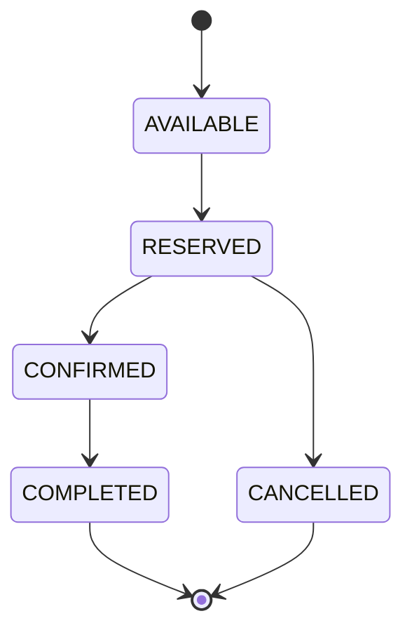
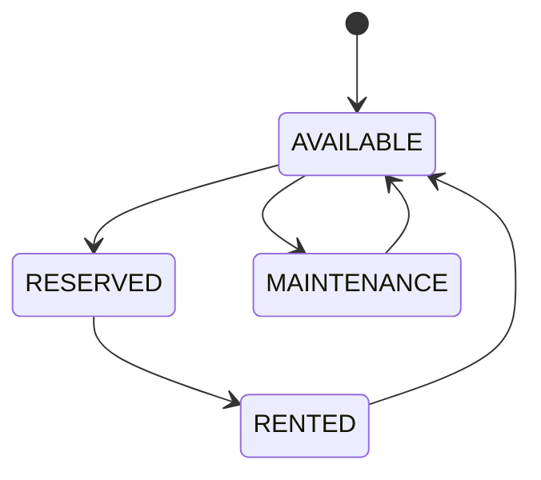
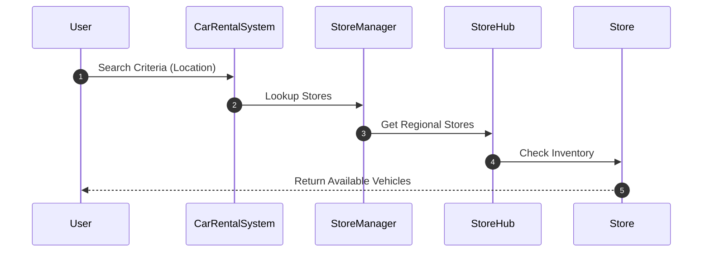
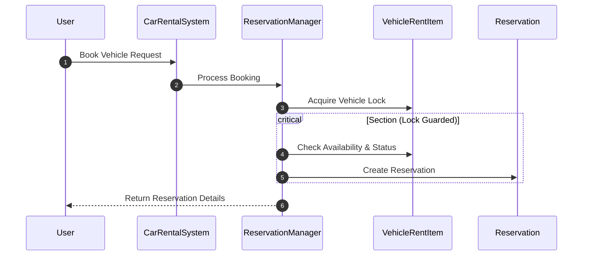
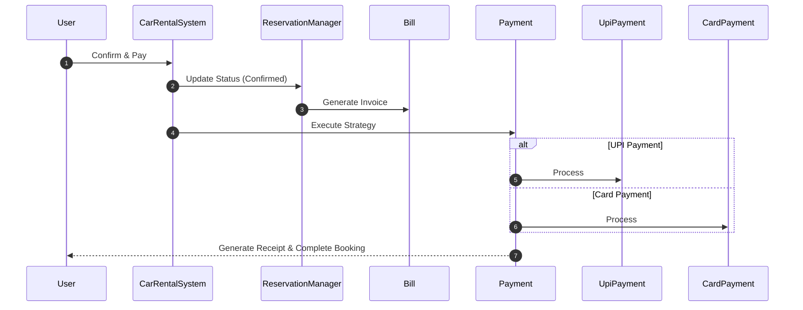
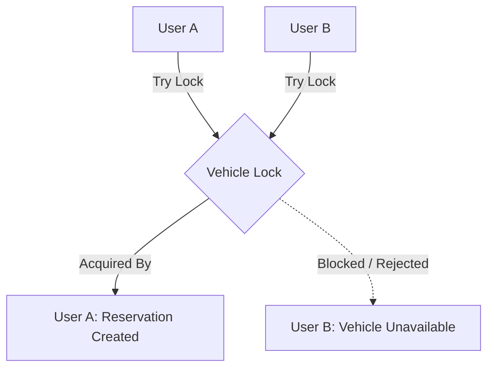

# Car Rental System - Low Level Design

## Problem Statement

Design a scalable and extensible Car Rental System that allows users to:

- Search available vehicles.
- Reserve and book vehicles.
- Make payments using multiple payment methods.
- Generate bills and payment receipts.
- Support multiple rental stores across locations.
- Handle concurrent booking requests safely.

The system should be modular, extensible, and capable of supporting future enhancements such as dynamic pricing, coupons, notifications, and multi-city rentals.

---

# Functional Requirements

- Users should be able to search available vehicles.
- Users should be able to reserve/book vehicles.
- Users should be able to make payments.
- Users should receive a bill/receipt after successful payment.
- The system should support adding new rental stores.
- The system should handle concurrent booking requests.
- The system should maintain vehicle availability.

---

# Core Entities

## User

Represents a customer using the rental platform.

**Responsibilities:**

- Maintain user profile information.
- Store contact details.
- Initiate vehicle searches and reservations.

---

## Vehicle

Base entity representing common vehicle attributes.

**Attributes:**

- Registration Number
- Vehicle Model
- Brand
- Fuel Type

---

## Car / SUV / Sedan / Hatchback

Specialized vehicle types extending the `Vehicle` class.

---

## VehicleRentItem

Represents an inventory item available for rental.

**Responsibilities:**

- Maintain rental pricing.
- Store vehicle ratings.
- Track availability status.
- Maintain rental metadata.

---

## Location

Represents geographical information.

**Attributes:**

- Country
- State
- City
- Postal Code
- Latitude
- Longitude

---

## Store

Represents a rental store containing multiple vehicles.

**Responsibilities:**

- Maintain vehicle inventory.
- Support inventory search.
- Manage local availability.

---

## StoreHub

Represents a collection of stores within a geographical region.

**Responsibilities:**

- Group regional stores.
- Support distributed inventory lookup.

---

## StoreManager

Singleton component responsible for managing stores and inventory lookup.

**Responsibilities:**

- Register stores.
- Search inventory across hubs.
- Coordinate store-level operations.

---

## Reservation

Represents a booking created by a user.

**Responsibilities:**

- Store reservation details.
- Maintain reservation status.
- Track booking lifecycle.

---

## ReservationManager

Handles reservation creation and lifecycle management.

**Responsibilities:**

- Create reservations.
- Validate bookings.
- Cancel reservations.
- Handle concurrency and locking.

---

## Payment

Strategy interface representing payment behavior.

---

## UpiPayment

Concrete implementation for UPI-based transactions.

---

## CardPayment

Concrete implementation for Debit/Credit Card transactions.

---

## Bill

Represents the invoice generated for a reservation.

**Responsibilities:**

- Generate booking invoice.
- Calculate payable amount.
- Maintain billing details.

---

## CarRentalSystem

Main system entry point.

**Responsibilities:**

- Coordinate search operations.
- Manage reservations.
- Trigger billing.
- Execute payments.

---

# Relationships

| Source | Target | Relationship |
|----------|----------|-------------|
| Store | VehicleRentItem | Composition |
| VehicleRentItem | Vehicle | Composition |
| StoreHub | Store | Composition |
| StoreManager | StoreHub | Association |
| StoreManager | Reservation | Association |
| CarRentalSystem | StoreManager | Composition |
| CarRentalSystem | ReservationManager | Dependency |
| CarRentalSystem | Payment | Dependency |
| Reservation | Bill | Association |

---

# Class Diagram

```text
+----------------------+
| CarRentalSystem      |
+----------------------+
           |
           |
           v

+----------------------+
| StoreManager         |
+----------------------+
           |
           |
           v

+----------------------+
| StoreHub             |
+----------------------+
           |
           |
           v

+----------------------+
| Store                |
+----------------------+
           |
           |
           v

+----------------------+
| VehicleRentItem      |
+----------------------+
           |
           |
           v

+----------------------+
| Vehicle              |
+----------------------+
      ^
      |
+-----+-----+------+------+
|           |             |
v           v             v

Car       Sedan         SUV

+----------------------+
| ReservationManager   |
+----------------------+
           |
           |
           v

+----------------------+
| Reservation          |
+----------------------+
           |
           |
           v

+----------------------+
| Bill                 |
+----------------------+

+----------------------+
| Payment              |
+----------------------+
          ^
          |
   +------+------+
   |             |
   v             v

UPIPayment   CardPayment

+----------------------+
| User                 |
+----------------------+

+----------------------+
| Location             |
+----------------------+
```

## Design Patterns Used

### 1. Singleton Pattern

**Used in:** `StoreManager`

**Reason:**  
Only one central manager coordinates stores, inventory lookup, and reservation tracking across the entire application.

---

### 2. Strategy Pattern

**Used in:** `Payment` Interface

**Implementations:**

- `UpiPayment`
- `CardPayment`
- `NetBankingPayment`

**Reason:**  
Allows introducing new payment methods without modifying existing business logic, following the Open-Closed Principle.

---

### 3. Inheritance / Generalization

**Used in:** `Vehicle` Hierarchy

**Reason:**  
Common vehicle behavior is defined in the base `Vehicle` class while specialized vehicle types extend it with their own attributes and functionality.

---

### 4. Composition

**Used in:**

- `Store → VehicleRentItem`
- `StoreHub → Store`

**Reason:**  
Child objects are owned by their parent container and do not exist independently.

---

# Lifecycles

## Reservation Lifecycle



---

## Vehicle Lifecycle



---

# System Flows

## 1. Search Vehicle



---

## 2. Reserve Vehicle



---

## 3. Complete Booking



---

# Concurrency Handling

To prevent double-booking and reservation conflicts:

- Each `VehicleRentItem` maintains an isolated lock (Mutex / Distributed Lock).
- `ReservationManager` must acquire the lock before starting reservation creation.
- Availability checks execute entirely inside the critical section.
- Vehicle state updates are performed atomically.
- The lock is released immediately after reservation finalization (success or rollback).

### Locking Flow



---

# Scalability Considerations

### Horizontal Expansion

New stores can be onboarded seamlessly through regional encapsulation within `StoreHub`.

### Open-Closed Principle

New vehicle categories can extend the base `Vehicle` class without impacting existing implementations.

### Extensible Payment Framework

New payment methods can be introduced by implementing the `Payment` strategy interface.

### Separation of Concerns

Reservation transaction logic remains isolated inside `ReservationManager`, simplifying maintenance and scaling.

### Distributed Search

Vehicle lookup requests can be distributed across multiple geographical `StoreHub` instances to improve performance and availability.

---

# Key Design Goals

### Scalability

- Support onboarding of new rental stores without impacting existing stores.
- Enable distributed search across multiple store hubs.
- Support future horizontal expansion.

### Extensibility

- Add new vehicle types through inheritance.
- Add new payment methods through the Strategy Pattern.
- Introduce future features with minimal code modifications.

### Reliability

- Prevent double booking using concurrency control.
- Maintain consistent vehicle availability states.
- Ensure transactional reservation processing.

### Maintainability

- Clear separation of responsibilities.
- Modular service-oriented design.
- Low coupling between components.
